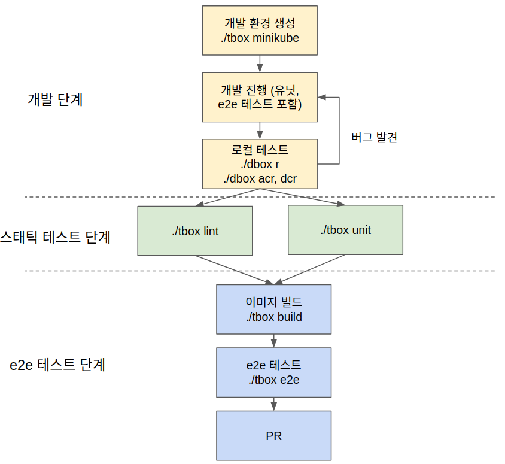

# Contributing

## 개발 워크플로우

1. 개발 환경을 생성합니다. Minikube none 드라이버로 rook을 포함해서 구축됩니다.
2. 개발을 진행합니다. 개발 시 유닛, e2e 테스트를 포함해서 개발해야 합니다.
3. 로컬 테스트를 진행합니다. dbox를 사용해서 테스트할 수 있습니다.
4. 스태틱 테스트를 진행합니다.
5. e2e 테스트를 진행합니다.

## 체크리스트
* [ ] 커밋을 정리하고 적절한 제목/내용을 작성하였는가
* [ ] 코드 제네레이트를 완료했는가? (`go mod verify`, `operator-sdk generate crds`, `operator-sdk generate k8s`)
* [ ] [체인지로그](CHANGELOG.md)와 [유저가이드](docs/USERGUIDE.md)를 작성했는가? 
* [ ] 필요한 유닛 테스트, e2e 테스트를 작성하였는가
* [ ] CRD Validation

### 주석/로그 작성법
- TODO

### 테스트 작성법
- TODO
