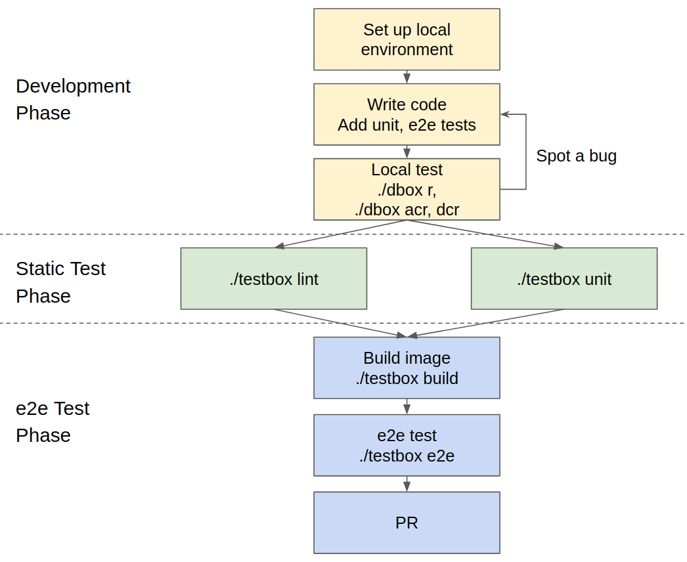

# Contributing

## Development Workflow

1. Setup a local development environment by executing following command: `./testbox minikube start`. It will install minikube with none driver option. If you don't have minikube on your machine, you can easily download minikube as well by `./testbox minikube download`.  Then, set up Ceph cluster by executing following command to install rook: `./testbox rook_install`.
2. Start code. Don't forget to add unit test and e2e test cases.
3. Test your code locally by executing following command: `./dbox`
4. Proceed with static test.
5. Proceed with e2e test.

## PR Checklist

* [ ] Commit is organized. Use `git rebase -i` if necessary
* [ ] Commit message is contain proper subject and body
* [ ] Code generation is completed (`go mod verify`, `operator-sdk generate crds`, `operator-sdk generate k8s`).  Use `./dbox g` for convenience
* [ ] CRD is validated
* [ ] [Change log](CHANGELOG.md) and [user guide](docs/USERGUIDE.md) has been updated when core functionality is affected.
* [ ] Code is fully tested. Unit test and e2e test should be included.
