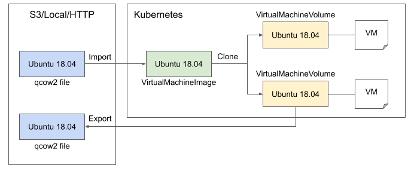

# User Guide



Kubevirt-Image-Service (KIS) has 3 custom resources to manage images and volumes. 

- `VirtualMachineImage` : imports a qcow2 image from external sources like HTTP, S3, and local path to K8s cluster. Imported image is saved as read-only PVC in K8s cluster and will be used to create volume for VMs. Currently HTTP is only supported import option.
- `VirtualMachineVolume` : creates a volume which will be used by VM from an image. Different from read-only image, created volume is able to write data. Only changed data between each volume is stored by utilizing snapshot and restore feature of CSI (Container Storage Interface). By this way, user can manage storage capacity efficiently. 
- `VirtualMachineExport` : converts a volume to a qcow2 file and exports it to external destinations. Currently export to local destination is only supported import option.

<br>

# Before you begin

- deploy K8s cluster through [minikube](https://kubernetes.io/docs/tasks/tools/install-minikube/), [kubeadm](https://kubernetes.io/docs/setup/production-environment/tools/kubeadm/install-kubeadm/), [kubespray](https://kubernetes.io/docs/setup/production-environment/tools/kubespray/), or [other methods](https://kubernetes.io/docs/setup/)
- deploy [kubevirt](https://kubevirt.io/pages/cloud.html)

A CSI plugin that can provision volume snapshot is needed. `StorageClass` and `VolumeSnapshotClass` are needed to deploy as well. 

For example, you can use rook-ceph rbd plugin. 

- deploy [rook-ceph](https://rook.github.io/docs/rook/master/ceph-quickstart.html)
- deploy [StorageClass](https://github.com/rook/rook/blob/master/cluster/examples/kubernetes/ceph/csi/rbd/storageclass.yaml)
- deploy [VolumeSnapshotClass](https://github.com/rook/rook/blob/master/cluster/examples/kubernetes/ceph/csi/rbd/snapshotclass.yaml)

<br>

# Install Kubevirt-Image-Service

``` shell
# Download kubevirt-image-service project 
$ git clone https://github.com/tmax-cloud/kubevirt-image-service.git

# Select release version that you want to install
$ cd kubevirt-image-service/
$ git checkout v1.0.0

# Deploy CRD
$ kubectl apply -f deploy/crds/hypercloud.tmaxanc.com_virtualmachineimages_crd.yaml
$ kubectl apply -f deploy/crds/hypercloud.tmaxanc.com_virtualmachinevolumes_crd.yaml
$ kubectl apply -f deploy/crds/hypercloud.tmaxanc.com_virtualmachinevolumeexports_crd.yaml

# Deploy operator
$ kubectl apply -f deploy/role.yaml
$ kubectl apply -f deploy/role_binding.yaml
$ kubectl apply -f deploy/service_account.yaml
$ kubectl apply -f deploy/operator.yaml

# Check operator status
$ kubectl get deployments.apps 
NAME                     READY   UP-TO-DATE   AVAILABLE   AGE
kubevirt-image-service   3/3     3            3           23s
```

<br>

# Use Kubevirt-Image-Service

## Import image from HTTP source

vmim is the shortname for `VirtualMachineImage`.

``` shell
# Deploy image CR. See the following yaml file for more information about each CR fields
$ kubectl apply -f deploy/crds/hypercloud.tmaxanc.com_v1alpha1_virtualmachineimage_cr.yaml

# Wait until image state is ready to use
$ kubectl get vmim
NAME       STATE
myubuntu   Available
```

## Create volume from image

vmv is the shortname for `VirtualMachineVolume`.

``` shell
# Deploy volume CR
$ kubectl apply -f deploy/crds/hypercloud.tmaxanc.com_v1alpha1_virtualmachinevolume_cr.yaml

# Wait until volume state is ready to use
$ kubectl get vmv
NAME         STATE
myrootdisk   Available
```

## Use created volume for VM 

On VM yaml file, add `disks` and `volumes` section with PVC and disk information

``` yaml
apiVersion: kubevirt.io/v1alpha3
kind: VirtualMachine
metadata:
  name: vm
spec:
  template:
    spec:
      domain:
        devices:
          disks:
          - name: disk0
            disk:
              bus: virtio
      volumes:
      - name: disk0
        persistentVolumeClaim:
          claimName: myubuntu-pvc # name of pvc created by volume, {$VmvName}-vmv-pvc
```
